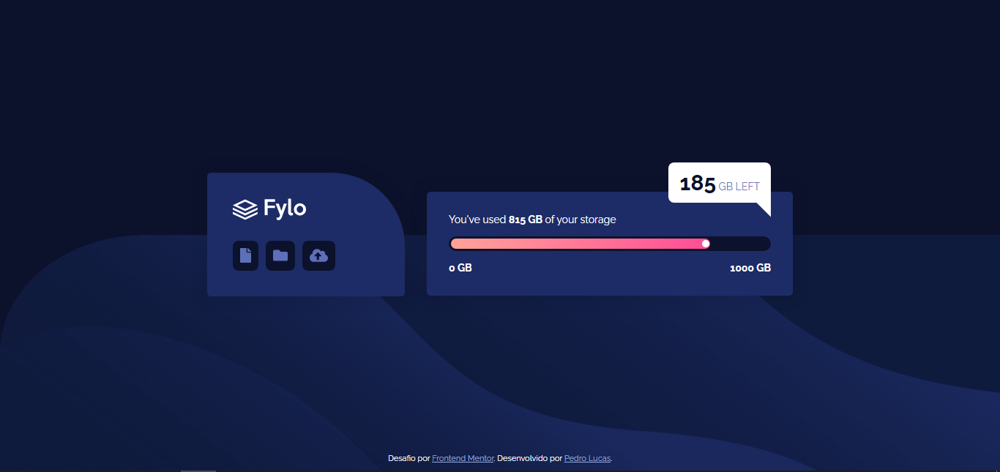
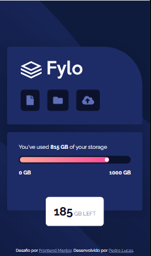

# Frontend Mentor - Solução Fylo data storage component

Essa é uma solução para o [Desafio Fylo Data Storage Component no Frontend Mentor](https://www.frontendmentor.io/challenges/fylo-data-storage-component-1dZPRbV5n). 

## Sumário dos conteúdos

- [Visão geral](#visão-geral)
  - [O desafio](#o-desafio)
  - [Screenshot](#screenshot)
  - [Link](#link)
- [Meu processo](#meu-processo)
  - [Resursos utilizados](#recursos-utilizados)
- [Autor](#autor)

## Visão Geral

### O desafio

Os usuários devem ser capazes de:

- Visualizar o layout ideal para a interface dependendo do tamanho da tela do seu dispositivo

### Screenshot

#### Versão desktop

#### Versão mobile

### Link

- URL da solução: [Frontend Mentor | Fylo data storage component](https://shyayhs.github.io/frontend-mentor-fylo-data-storage/)

## Meu processo

### Recursos utilizados

- Marcação semântica HTML5
- Propriedades personalizadas CSS
- Flexbox
- CSS Grid

## Autor

- Linkedin - [Pedro Lucas](www.linkedin.com/in/pedro-lucas-rocha)
- Frontend Mentor - [@Shyayhs](https://www.frontendmentor.io/profile/Shyayhs)
- Github - [@Shyayhs](https://github.com/Shyayhs)